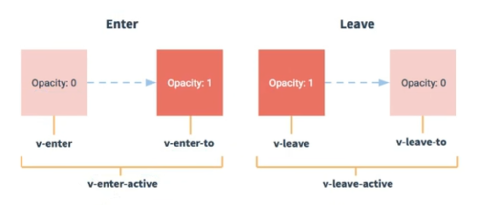

## 学习vue框架的一些学习笔记和代码记录

## vue.config.js配置文件
>1.使用`vue inspect > output.js`可以查看到Vue脚手架的默认配置，但是不能更改
>2.使用vue.config.js可以对脚手架进行个性化定制，详情见Vue官网：https://cli.vuejs.org/zh/config/

## ref属性
> 1.被用来给元素或子组件注册引用信息（id的替代者）
> 2.应用在html标签上获取的是真实DOM元素，应用在组件标签上是组件实例对象（vc）
> 3.使用方式：
      *添加标识：`<h1 ref="xxx"></h1>`或`<School ref="xxx"></School>`
      获取：this.$refs.xxx*

## 配置项props
>##### 功能：让组件接收外部传过来的数据
(1）传递数据:`<Demo name="xxx">`
(2) 接收数据：
 >       1.只接收：props:[name]

 >       2.接受的同时限制类型：
```javascript
      props：{
            name:String,
            age:Number
      }
```

>       3.限制类型+限制必要性+指定默认值
```javascript
        props:{
            name:{
                  type:String,
                  required:true  //必要性
            },
            age:{
                  type:Number,
                  default:99  //默认值
            }
        }
```
>备注：props是只读的，Vue底层会监测props的改变，如果进行了修改，就会发出警告。若业务需求确实需要更改，那么请复制一份props的内容到data中，然后去修改data中的数据。
   
## mixin（混入）
##### 功能：可以把多个组件共用的配置提取成一个混入对象
使用方式：
  第一步：定义混合 例如：
  ```javascript

  export const a={
      data(){....},
      methods:{....}
      ....
  }
  ```
  第二步：使用混入,例如：
 > (1)全局混入：`Vue.mixin(a)`
 > (2)局部混入：`mixins:[a]`

## 插件
##### 功能：用于增强Vue
>本质：包含install方法的一个对象，install的第一个参数是Vue，第二个以后的参数是插件使用者传递的数据。
定义插件：
```javascript
对象.install = function(Vue,options){

      //1.添加全局过滤器
      Vue.filter(....)

      //2.添加全局指令
      Vue.directive(....)

      //3.配置全局混入（合）
      Vue.mixin(....)

      //4.添加实例方法
      Vue.propotype.$myMethod=function(){....}
      Vue.propotype.$myPropotype=xxx
      
}
```
>使用插件： `Vue.use()`

## scoped样式
>作用：让样式在局部生效，防止冲突
>写法：`<style scoped>`

## 总结TodoList案例
>1.组件化编码流程：
  （1）。拆分静态组件：组件按照功能点拆分，命名不要与HTML元素冲突。
  （2）实现动态组件：考虑好数据的存放位置，数据是一个组件在用，还是一些组件在用。
      a.一个组件在用：放在组件自身即可
      b.一些组件在用：放在他们共同的父组件上（状态提升）
   (3)实现交互：从绑定事件开始

> 2.props适用于：
  （1）父组件==>子组件通信
  （2）子组件==>父组件通信（要求父组件先给子组件一个函数）

> 3.使用v-model时要切记：v-model绑定的值不能是props传过来的值，因为props是不可以被修改的

> 4.props传过来的若是对象类型的值，修改对象中的属性时Vue不会报错，但不推荐这样做。

## webStorage
>1.存储内容大小一般支持5MB左右（不同浏览器可能不一样）

>2.浏览器端通过`Window.sessionStorage`和`Window.localStorage`属性实现本地存储机制

>3.相关API：
1. `xxxxxStorage.setItem('key','value');`
    此方法接收一个键和值作为参数，会把键值对添加到存储中，如果键名存在，则更新其对应的值。
2. `xxxxxStorage.getItem('key');`
    此方法接收一个键名作为参数，返回键名对应的值。
3. `xxxxxStorage.removeItem('key');`
    此方法接收一个键名作为参数，并把该键名从存储中删除。
4. `xxxxxStorage.clear()`
    此方法会清空存储中的所有数据

> 4.备注：
*  localStorage和sessionStorage的区别：
      （1）localStorage中存储的数据需要手动清除才会消失，例如在浏览器的设置里面清除缓存，或者设置按钮特地删除数据
      （2）sessionStorage中存储的数据在关闭网页时就会被清除。
* `xxxxxStorage.getItem(xxx) `如果对应的value获取不到，那么getItem的返回值是null。
* JSON.parse()方法将json格式的字符串转换为js对象，JSON.parse(null)的结果依然是null

## 组件的自定义事件

> 1.一种组件间通信的方式,适用于: 子组件===>父组件

> 2.使用场景:A是父组件,B是子组件,B要给A传数据,那么就要在A中给B绑定自定义事件(事件的回调在A中).

> 3.绑定自定义事件:

(1)在父组件中:`<Demo @myThing="test"/>` 或 `<Demo v-on:myThing="test"/>`
(2)在父组件中:

```javascript
<!-- 给Demo组件添加ref属性 -->
<Demo ref="demo"/>
...
mounted(){
    <!-- 通过$on给组件绑定自定义事件,this.test是回调函数 -->
    this.$refs.demo.$on('myThing',this.test)
}

```
(3)若想让自定义事件只触发一次,可以使用once修饰符或$once方法

> 4.触发自定义事件: `this.$emit('myThing',传递数据)`

> 5.解绑自定义事件

(1)解绑单个自定义事件 `this.$off('myThing')`
(2)若解绑多个自定义事件 `this.$off(['thing1','thing2'])`
(3)解绑所有自定义事件 `this.$off()`

> 6.组件上也可以绑定原生DOM事件,需要使用native修饰符.

> 7.注意:通过`this.$refs.xxx.$on('myThing',回调)`绑定自定义事件时,回调要么配置在methods中,要么使用箭头函数,否则this指向会出问题.

## 全局事件总线(GlobalEventBus)
> 1.一种组件间通信的方式,适用于任意组件间通信.

>2.安装全局事件总线:
```javascript
new Vue({
    ....
    beforeCreate(){
        Vue.prototype.$bus=this //安装全局事件总线,$bus就是当前应用的vm
    },
    ....
})
```
>3.使用事件总线:

(1)接收数据:A组件想接收数据,则在A组件中给$bus绑定自定义事件,事件的回调留在A组件自身.
```javascript
methods:{
    demo(datas){....}
}
....
mounted(){
    this.$bus.$on('xxxx',this.demo)
}
```
(2)提供数据:`this.$bus.$emit('xxxx',datas)`
> 4.最好在beforeDestroy钩子中,用$off去解绑当前组件所用到的事件.

## 消息订阅与发布

> 1.一种组件间通信的方式,适用于任意组件间通信.

>2.使用步骤:

(1)安装`pubsub: npm -i pubsub-js`

(2)引入:`import pubsub from 'pubsub-js'`

(3)接收数据:A组件需要接收数据,则在A组件中订阅消息,订阅的回调留在A组件自身.
```javascript
methods:{
    //回调函数接收两个参数,第一个是订阅名xxx,第二个是发布的消息data
    //或者将回调函数写在订阅消息的方法中,但必须为箭头函数
    demo(xxx,datas){....}
},
...
mounted(){
    this.pid=pubsub.subscribe('xxx',this.demo) 
    //订阅消息,订阅之后返回一个订阅的id,可以根据id取消订阅
}
```
> 4.提供数据:`pubsub.publish('xxx',datas)`

>5.最好在beforeDestroy钩子中,用`pubsub.unsubscribe(pid)`去取消订阅.

## Vue封装的过渡与动画
>1.作用：在插入。更新或移除DOM元素时，在合适的时候给元素添加样式类名。

>2.图示：


>3.写法：
 >> 1.准备好样式：
   >>* 元素进入的样式：
    >>>> 1.v-enter:进入的起点
        2.v-enter-active:进入的过程中
        3.v-enter-to：进入的终点
   >>* 元素离开的样式：
   >>>>1.v-leave:离开的起点
       2.v-leave-active:离开过程中
       3.v-leave-to：离开的终点
 >> 2.使用`<transition>`包裹要过渡的元素，并配置name属性：
 ```javascript
 <transition name="hello">
    <h1 v-show="isShow">你好啊！<h1/>
</transition>
```
>>3.备注：若有多个元素需要过渡，则需要使用：`<transition-group>`，且每个元素都要指定key值。

## vue脚手架配置代理
>1.方法一

在vue.config.js中添加如下配置：
```javascript
devServer:{
    proxy:'http://localhost:8888'
}
```
说明：
1.优点：配置简单，请求资源时直接发给前端（8080）即可。
2.缺点：不能配置多个代理，不能灵活的控制请求是否走代理。
3.工作方式：若按照上述方式配置代理，当请求了前端不存在的资源时，那么该请求会转发给服务器（优先匹配前端资源）
>2.方法二

编写vue.config.js配置具体代理规则：
```javascript
modules.exports={
    devServer:{
        proxy:{
            '/api1':{  //匹配所有以'/api1'开头的请求路径
                target:'http://localhost:5000',  //代理目标的基础路径
                pathRewrite:{'^/api1':''},  //将前端编写的前缀'/api1'去除
                ws:true,
                changeOrigin:true,
            },
            '/api2':{
                target:'http://localhost:5001',
                pathRewrite:{'^/api2':''},
                ws:true,
                changeOrigin:true,
            },
        }
    }
    // changeOrigin为true时，服务器收到的请求头中的host为：localhost：5000
    // changeOrigin为false时，服务器收到的请求头中的host为：localhost：8080
    // changeOrigin默认值为true
}
```
说明：
   1.优点：可以配置多个代理，且可以灵活的控制请求是否走代理
   2.缺点：配置略微繁琐，请求资源时必须加前缀